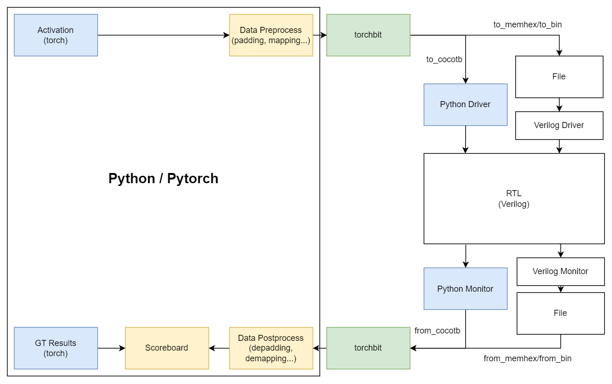

Torchbit, utils for deep learning accelerator verification, convert pytorch tensor to cocotb compatiable / binfile format

# Usage

```
# install dependencies Numpy, Pytorch, Matplotlib
git clone https://github.com/Devil-SX/torchbit.git
cd torchbit
pip install -e .
```

# Design Philosophy

All data rearrange / tilling / padding should be implemented using advanced tensor processing libraries like `einops` `torch` in Python



# Endianness

torchbit would dump binfile / hexfile to **BIG-ENDIAN**

| Type | Endianness | 
| --- | --- |
| x86 | little endian | 
| NVIDIA GPU | little endian |
| default numpy | `=` same as CPU |
| default torch (device = "cpu") | `=` same as CPU |
| Verilog | big endian |


The default endianness of x86 is little endian, which can be checked by `lscpu | grep "Byte Order"`

Verilog `$readmemh` `$fread` function use big-endian, which is different

Such a bf16 tensor `[1., 2., 3.]`

| Decimal |  Big Endian | Little Endian|
|---  | --- | --- |
| 1 | 0x3F80 | 0x803F |
| 2 | 0x4000 | 0x0040 |
| 3 | 0x4040 | 0x4040 |


Dump to hexfile / binfile

```
40 40 40 00 3F 80 00 00
```

Dump to cocotb

```
value = 0x3F80 | 0x4000 << 16 | 0x4040 << 32
```

**Implementation Details**

There are three concept need to be concerned: bytes,decimal value, data type

`-` means keep same, `?` means unknown, `x` means change

| Method | Bytes | Decimal Value| Data Type |
| --- | --- | --- | --- |
| torch / numpy `.view()` | - | ? | x |
| torch `.to()` / numpy `.astype()` | ? | - | x |


# Python Driver/Monitor

Hensor: Hardware 1D Tensor

- pytorch 1D-tensor -> cocotb input, `Hensor.from_tensor(tensor).to_cocotb()`
- cocotb output -> pytorch 1D-tensor, `Hensor.from_cocotb(dut.io_xx.value, num, dtype).to_tensor()`

# Verilog Driver/Monitor

Hlist: Hardware 2D Tensor, use pointer to read

- pytorch 2D-tensor -> memhex / bin file
- memhex / bin file -> reader -> 1D logic
- 1D logic ->  collector -> memhex / bin file
- memhex / bin file -> pytorch 2D-tensor
