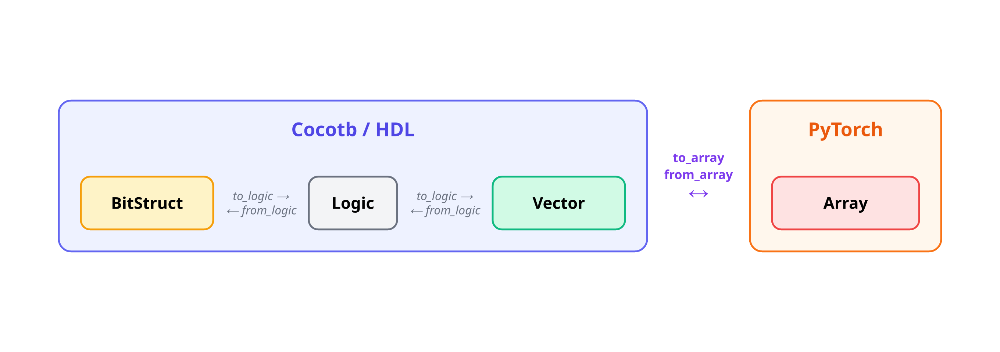
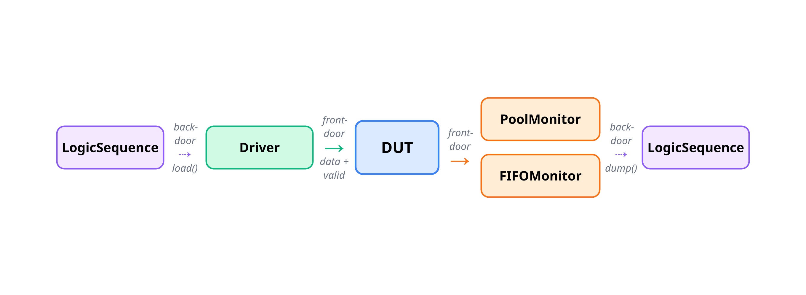
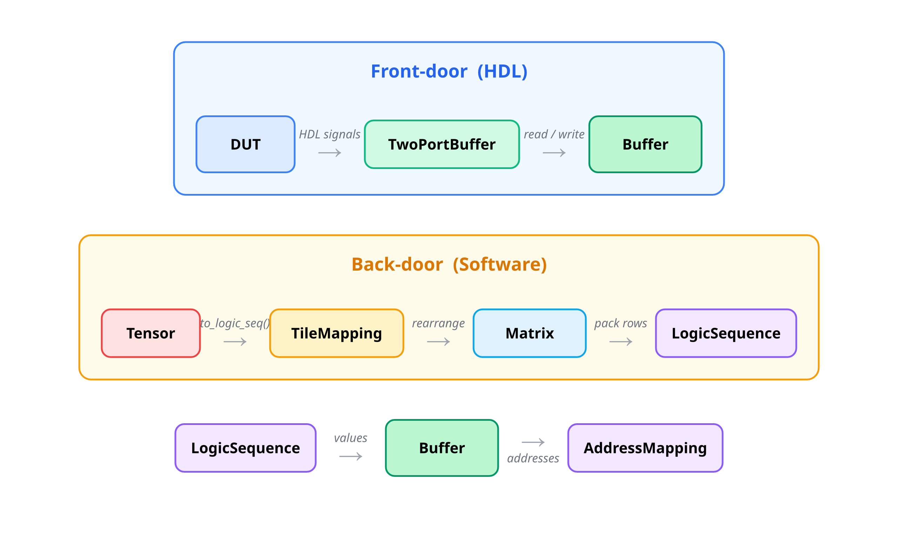

<h1 align="center">Torchbit</h1>

<p align="center">
  
  
  
  
</p>

<p align="center">
  <a href="./README.md">English</a> | <a href="./README.zh-CN.md">简体中文</a>
</p>

Torchbit 为深度学习加速器验证提供实用工具，便于将 PyTorch 张量转换为 Cocotb 兼容格式。

**为什么选择 Torchbit？** AI 加速器开发应优先考虑 Python。

- 所有数据重排、分块和填充都应使用 `einops` 和 `torch` 等高级张量处理库在 Python 中实现，而不是在 Verilog 或 C++ 中使用 `for` 循环。
- 与 `torch` 的兼容性是首要任务，确保与算法 Golden Model 无缝集成。


# 功能特性

- **快速构建 torch 原生测试框架：**
    - 将任意 `torch` 数据类型映射到 `cocotb` 框架激励。
    - 基于 `einops` 抽象 Tensor 映射过程。
    - 包含可重用组件（如 Buffer、FIFO）。
- **快速调试**（目前开发中）。

# 快速开始

## 安装

```bash
pip install git+https://github.com/Devil-SX/torchbit.git
```

主分支目前为使用 `cocotb >= 2.x`、Verilator >= 5.036 和 VCS 的环境维护。


## 兼容性

| 操作系统 | Cocotb  | 模拟器 | 状态 | 备注 |
|----|---------|-----------|--------|-------|
| WSL Ubuntu 22.04 | 2.0.0 | Verilator 5.038 | ✅ |  |
| WSL Ubuntu 22.04 | 2.0.0 | Verilator 5.036 | ❌ | fst 断言失败，参见 [此 issue](https://github.com/cocotb/cocotb/issues/4522) |
| CentOS 7 | 2.0.0 | VCS | ✅ |  |


# 设计哲学

Tensor 的处理主要分为两个关键，对值的处理，以及对形状的处理。对值的处理分为如何将各种 torch 支持的数据格式 float、signed、unsigned、brain-float 映射到 Verilog 的 bits 上。对形状的处理则包括复杂的 Tilling 变换等过程。底层值变换原理参考 [value.md](./doc/zh-CN/value.md)，tilling 设计原理参考 [tilling_schedule.md](./doc/zh-CN/tilling_schedule.md)。

# 基本数据类型

Torchbit 定义了软件侧（PyTorch）和硬件侧（Cocotb/HDL）两套术语，通过转换方法相互连接。

## 术语

| | PyTorch（软件侧） | Cocotb / HDL（硬件侧） |
|---|---|---|
| **单值** | **Array** — 1D Tensor | **Logic** — 任意信号的打包整数 |
| | | **Vector** — Array 的封装，对应 SIMD 并行接口 |
| | | **BitStruct** — 可自定义 field 的接口 |
| **序列** | **Matrix** — 2D Tensor | **LogicSequence** — Logic 值的序列 |
| | | **VectorSequence** — Vector 的序列 |

## Transaction：单值转换

[Vector](./torchbit/core/vector.py) 是 PyTorch Array 与 HDL Logic 值之间的核心桥梁。`BitStruct` 定义自定义字段布局，同样可以与 Logic 互转。



### Array → Logic（驱动信号）

```python
from torchbit.core import Vector, array_to_logic

x = torch.tensor([1.0, 2.0, 3.0, 4.0, 5.0], dtype=torch.float32)

# 分步操作
vec = Vector.from_array(x)          # Array → Vector
dut.io_din.value = vec.to_logic()   # Vector → Logic

# 一行快捷方式
dut.io_din.value = array_to_logic(x)
```

### Logic → Array（读取信号）

```python
from torchbit.core import Vector, logic_to_array

# 分步操作
vec = Vector.from_logic(dut.io_dout.value, 5, torch.float32)
x = vec.to_array()                   # Logic → Vector → Array

# 一行快捷方式
x = logic_to_array(dut.io_dout.value, 5, torch.float32)
```

> **向后兼容：** `from_tensor`/`to_tensor`、`from_cocotb`/`to_cocotb`、`to_int`、`tensor_to_cocotb`/`cocotb_to_tensor` 均保留为别名。

## Sequence：批量值转换

对于多值序列（例如多个时钟周期），`VectorSequence` 在 PyTorch 2D Matrix 与 HDL LogicSequence 之间桥接。


```python
from torchbit.core import VectorSequence

matrix = torch.randn(256, 4)                     # 2D Matrix
vs = VectorSequence.from_matrix(matrix)           # Matrix → VectorSequence
logic_seq = vs.to_logic_sequence()                # VectorSequence → LogicSequence
restored = VectorSequence.from_logic_sequence(logic_seq, 4, torch.float32)
```

> **向后兼容：** `from_tensor`/`to_tensor`、`to_int_sequence`/`from_int_sequence` 均保留为别名。

## Tensor ↔ LogicSequence：通过 TileMapping 转换

在实际硬件中，高维 Tensor（如 `c h w`）需要被重排和序列化为按时间排列的打包值序列进行传输。`TileMapping` 端到端地处理这一过程：

```
Tensor  ──rearrange──►  Matrix (2D)  ──pack rows──►  LogicSequence
 (c h w)     einops       (c, h*w)      Vector          [int, ...]
```

转换分为两个阶段：

1. **Rearrange**（形状）：`einops.rearrange` 将 Tensor 重排为 2D Matrix，每行代表一个时钟周期的数据（空间维度），行数等于时钟周期数（时间维度）。
2. **Pack**（值）：Matrix 的每一行通过 `Vector` 打包为一个整数，生成 `LogicSequence`。

```python
from torchbit.tiling import TileMapping, array_to_logic_seq, logic_seq_to_array

mapping = TileMapping(
    dtype=torch.float32,
    sw_einops="c h w",
    hw_einops="c (h w)",
    hw_temp_dim={"c": 3},
    hw_spat_dim={"h": 32, "w": 32},
)

tensor = torch.randn(3, 32, 32)

# Tensor → LogicSequence（高级快捷方式）
seq = array_to_logic_seq(tensor, mapping)

# LogicSequence → Tensor
restored = logic_seq_to_array(seq, mapping)
assert torch.allclose(tensor, restored)
```

也可以使用低级快捷方式，无需 TileMapping，直接操作 2D Matrix：

```python
from torchbit.tiling import matrix_to_logic_seq, logic_seq_to_matrix

matrix = torch.randn(256, 4)
seq = matrix_to_logic_seq(matrix)                            # Matrix → LogicSequence
restored = logic_seq_to_matrix(seq, 4, torch.float32)        # LogicSequence → Matrix
```

> **向后兼容：** `tensor_to_cocotb_seq`/`cocotb_seq_to_tensor` 保留为 `array_to_logic_seq`/`logic_seq_to_array` 的别名。

## 工具概览



- **Driver**：通过前门（data + valid）信号将 `LogicSequence` 送入 DUT。
- **PoolMonitor / FIFOMonitor**：通过前门信号将 DUT 输出收集为 `LogicSequence`。



- **Buffer**：同时支持前门（HDL）和后门（软件）访问的存储模型。
- **TileMapping**：将 Tensor 重排为 Matrix，再打包为 `LogicSequence`。
- **AddressMapping**：为后门存储访问生成地址序列。

# 使用内置运行器在 Verilator/VCS 上运行

`torchbit.runner` 包括预构建的 Cocotb 启动封装，可配置常见模拟器参数。您可以使用标准 Cocotb 接口编写测试平台，也可以利用 Torchbit 的辅助函数。

首先，创建主测试文件（`top_test.py`）和源文件列表。文件列表可以使用相对于任何位置的路径。

```python
# top_test.py
from torchbit.runner import (
    Runner,
    FileConfig,
    BuildConfig,
    DEFAULT_VCS_BUILD_CONFIG, # 如果使用 verilator，使用 DEFAULT_VERILATOR_BUILD_CONFIG
    read_filelist
)
import cocotb

# 用户可修改变量
file_config_name = "my_design_name" # 用于标识 build_dir 的名称，可以设置为顶层模块名称。
filelist_path = "filelist 路径" # Verilog/SystemVerilog filelist 的路径。
filelist_base_path = "相对于 filelist 的路径" # filelist 中相对路径的基础路径。
top_design_name = "top_module_name" # 顶层设计模块的名称。
# include_dirs = ["inc_dir1", "inc_dir2"] # 如果有包含目录，请添加。
output_dir = "output_files" # 生成输出文件的父目录。


TOP_FILE_CONFIG = FileConfig(
    name=file_config_name,
    sources=read_filelist(filelist_path, base_path=filelist_base_path),
    top_design=top_design_name,
    includes=include_dirs
)

TOP_RUNNER = Runner(
    file_config=TOP_FILE_CONFIG,
    build_config=DEFAULT_VCS_BUILD_CONFIG,
    current_dir=output_dir
)

@cocotb.test()
async def testbench():
    # 在此处编写测试平台

if __name__ == "__main__":
    TOP_RUNNER.test("top_test")

```

然后，只需运行 `python top_test.py`。执行后，将在 `output_dir` 下生成一个 `sim_xx` 文件夹。在此目录中，您可以找到编译文件和相应的波形。如果使用 Verilator，波形文件是 `dump.fst`；如果使用 VCS，则是 `dump.fsdb`。

`.fsdb` 文件存储运行时数据库。您可以通过运行 `verdi -ssf dump.fsdb` 直接查看相应的源代码。


